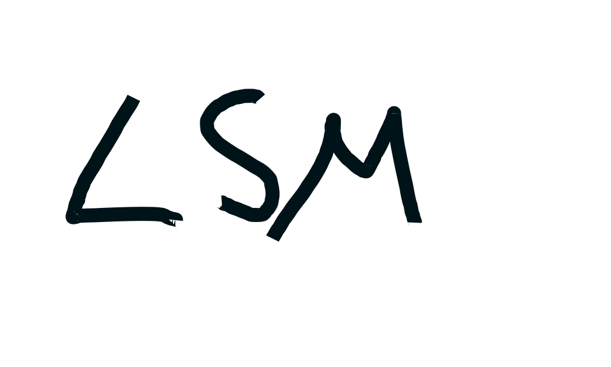

<div align="center">
  

  <h1>Hightower Servers</h1>
  <p><strong>Local Server Manager (LSM)</strong> , a self-hosted web UI that runs dedicated game servers as Docker containers on your own machine.</p>

  <p>
    <a href="LICENSE"></a>
    <a href="doc/CHANGELOG.md"></a>
    <a href="https://ko-fi.com/plrhightower"></a>
  </p>
</div>

---

Create a Minecraft, Valheim, or Palworld server from a form in your browser, then start, stop, monitor, and back it up from the same place. Each server is a Docker container on the host; worlds live in Docker volumes you can browse, upload to, and download as a zip straight from the UI.

**Features**

- Create servers from a per-game form (versions, modpacks, RAM, ports, game-specific settings) with schema validation shared between the frontend and backend.
- Start / stop / restart, live status reconciled against Docker's own event stream, CPU and RAM stats per server.
- World and file manager: browse a server's volumes, upload files, download files or whole directories as zip archives.
- Per-server manager password (bcrypt-hashed) gating destructive actions, with an optional host-wide admin override.
- Guardrails against overcommitting the host: RAM safety margin, a total server cap, and a creation rate limit.
- Container logs through an embedded [Dozzle](https://dozzle.dev/) at `/dozzle`.
- Seven themes, remembered in local storage.

**Stack** , Vue 3 + Vite + Pinia behind nginx · Express 5 + TypeScript + dockerode · MySQL 8 · zod schemas in a shared npm workspace · Vitest on both sides.

---

## ⚠️ Read this before you install

This is a **trusted-LAN tool, not an internet-facing control panel.**

- **There is no login.** The web UI is unauthenticated. Anyone who can reach port 80 can create and delete game servers. The per-server manager password only gates management actions on an individual server.
- **The backend mounts `/var/run/docker.sock` and runs as `root`.** That is, by design, full control of the Docker daemon , which is equivalent to root on the host. Anyone who can reach the API can, in effect, run arbitrary containers on your machine.
- **MySQL is published on the host** (port 3306 by default) and the database container uses `DB_PASSWORD` as its **root** password.

Run it on a machine you own, on a network you trust. Do not port-forward it. If you need remote access, put it behind a VPN (WireGuard, Tailscale) or an authenticating reverse proxy , not a bare port forward.

---

## Requirements

- Linux host (the scripts use bash, `systemctl`, and host paths such as `/var/lib/docker/volumes`)
- [Docker Engine](https://docs.docker.com/engine/install/) with the Compose plugin (`docker compose`), and permission to use it (`sudo`, or your user in the `docker` group)
- Node.js 20+ and npm , only needed for local development; the containers build their own
- Disk space for game images and worlds (the Minecraft image alone is a few GB)
- Enough RAM for the servers you intend to run, plus headroom for the host

## Setup

```bash
git clone https://github.com/plr-hightower/HightowerServers.git
cd HightowerServers

# 1. Configure
cp .env.example .env
$EDITOR .env            # at minimum, set DB_PASSWORD

# 2. Fetch the game server images (pulls from Docker Hub, saves them to images/)
./scripts/fetch_all_images.sh

# 3. Bring everything up: load images, build and start containers, run migrations
./scripts/init.sh
```

Then open:

| | |
|---|---|
| Web UI | <http://localhost> |
| API | <http://localhost/api> (backend listens on `:4532`) |
| Container logs | <http://localhost/dozzle> |
| Database | `localhost:3306` |

`init.sh` is idempotent , re-run it after pulling changes and it will rebuild the containers and apply any new migrations. Migrations are tracked in a `migrations` table, so applied files are skipped.

### Why images are fetched separately

Game server images are **not** included in this repository, and `images/*.tar` is git-ignored. `fetch_all_images.sh` reads the image reference out of each `backend/src/services/games/*.service.ts`, pulls it, `docker save`s it to `images/<game>.tar`, and loads it. That keeps the repo small and means you pull each upstream image from its own publisher, under its own license, rather than getting a redistributed copy from me.

If a game directory `docker/<game>/Dockerfile` exists, that image is **built** locally instead of pulled , the hook for running a patched fork of an upstream image.

## Configuration

Every variable lives in `.env`; `.env.example` documents all of them. The ones that matter most:

| Variable | Default | Purpose |
|---|---|---|
| `DB_PASSWORD` | , | **Required.** MySQL user password *and* the database container's root password |
| `DB_USER` / `DB_NAME` | `hightower-admin` / `hightower` | Database credentials |
| `DB_HOST` | `127.0.0.1` | Only used when running the backend outside Docker; Compose overrides it to `database` |
| `DB_EXPOSE_PORT` | `3306` | Published MySQL port, also the backend's connection port |
| `MIGRATIONS_DIR` | `./backend/src/db/migrations` | Where `migration.sh` looks for `.sql` files |
| `ADMIN_MASTER_PASSWORD` | unset | Optional override that unlocks any server. Unset = disabled |
| `MAX_TOTAL_SERVERS` | `40` | Hard cap on concurrent servers |
| `MAX_SERVERS_WITHIN_WINDOW` / `CREATE_SERVER_WINDOW_MINUTES` | `1` / `60` | Server-creation rate limit |
| `RAM_SAFETY_MARGIN_MB` | `512` | Host RAM kept free; creation is refused if a server would eat into it |
| `MAX_UPLOAD_FILE_MB` | `32768` | Upload size limit for the file manager |
| `LOG_LEVEL` | `info` | Pino log level |

## Development

```bash
npm install              # installs all workspaces (frontend, backend, shared)

npm run build:shared     # the shared package must be built before the others resolve it
npm run dev:backend      # tsx watch , needs DB_HOST=127.0.0.1 and the database container up
npm run dev:frontend     # vite dev server

npm test --workspace=backend
npm test --workspace=frontend
npm run build:all
```

Useful scripts:

| Script | What it does |
|---|---|
| `scripts/init.sh` | Full bring-up: load images → `docker compose up -d --build` → migrations |
| `scripts/fetch_all_images.sh` | Pull/build, save, and load every game image referenced in the code |
| `scripts/migration.sh` | Apply pending SQL migrations, tracked in the `migrations` table |
| `scripts/release.sh start\|finish` | GitFlow release: version bump across workspaces, changelog roll, tag, merge |

### Adding a game

1. Add `backend/src/services/games/<game>.service.ts` implementing `IGameService`, with an `image: '<publisher>/<image>:<tag>'` field.
2. Add its settings schema to `shared/src/`.
3. Run `./scripts/fetch_all_images.sh` , it discovers the new image reference automatically, no list to update.

Every pull request must update [`doc/CHANGELOG.md`](doc/CHANGELOG.md); CI enforces it. See [CONTRIBUTING.md](CONTRIBUTING.md).

---

## Legal

### License

Copyright (C) 2026 Alexandre Dmitriev.

This program is free software: you can redistribute it and/or modify it under the terms of the **GNU Affero General Public License** as published by the Free Software Foundation, either version 3 of the License, or (at your option) any later version. See [LICENSE](LICENSE) for the full text.

It is distributed in the hope that it will be useful, but **WITHOUT ANY WARRANTY**; without even the implied warranty of MERCHANTABILITY or FITNESS FOR A PARTICULAR PURPOSE.

The AGPL means: if you modify this software and let other people use it over a network, you must offer those users the complete source of your modified version under the same license.

### Source code notice (AGPL section 13)

The AGPL requires that anyone interacting with this program **over a network** be offered its complete corresponding source. This repository is that source for the unmodified version, and the running application shows a **Source code** link in its footer pointing here.

**If you modify LSM and let anyone else use it over a network** (a friend's browser counts), you must:

1. publish your modified source under the AGPL-3.0-or-later, and
2. change `sourceUrl` in [`frontend/src/App.vue`](frontend/src/App.vue) so the footer link points at *your* source instead of this repository.

Leaving that link pointing here while running modified code does not satisfy section 13.

### Third-party software

This repository contains no third-party game code or binaries. Game servers run in Docker images published by their own maintainers, pulled directly from Docker Hub at setup time and each governed by its own license:

| Game | Image | Upstream |
|---|---|---|
| Minecraft | `itzg/minecraft-server` | <https://github.com/itzg/docker-minecraft-server> |
| Valheim | `lloesche/valheim-server` | <https://github.com/lloesche/valheim-server-docker> |
| Palworld | `thijsvanloef/palworld-server-docker` | <https://github.com/thijsvanloef/palworld-server-docker> |

It also runs `mysql:8`, `nginx:alpine`, `node:20-slim`, and `amir20/dozzle`. Node dependencies are MIT / Apache-2.0 / ISC / BSD licensed.

### Trademarks and game terms of service

Minecraft is a trademark of Mojang Synergies AB / Microsoft. Valheim is a trademark of Iron Gate AB. Palworld is a trademark of Pocketpair, Inc. This project is **not affiliated with, endorsed by, or sponsored by** any of them, and uses their names only to identify which game server software it can launch.

**You are the server operator, and the game publishers' terms apply to you:**

- Running a Minecraft server means accepting the [Minecraft EULA](https://www.minecraft.net/eula) and Mojang's [commercial usage guidelines](https://www.minecraft.net/usage-guidelines). For convenience this application sets `EULA=TRUE` on the Minecraft container by default , **by creating a Minecraft server with it you are accepting that EULA yourself.** If you don't accept it, don't create Minecraft servers.
- Valheim and Palworld dedicated servers are likewise subject to their publishers' EULAs and server-hosting terms.
- Nothing here distributes or circumvents any game client, license check, or paid content. Your players still need their own legitimately purchased copies.

---

## Support this project

If Hightower Servers saves you some time, you can buy me a coffee , it's genuinely appreciated and entirely optional. The software is and stays free.

<a href="https://ko-fi.com/plrhightower"></a>
